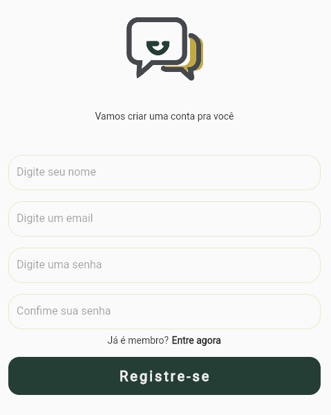
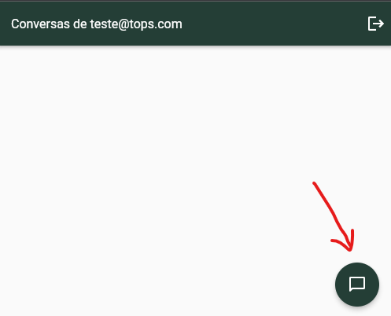
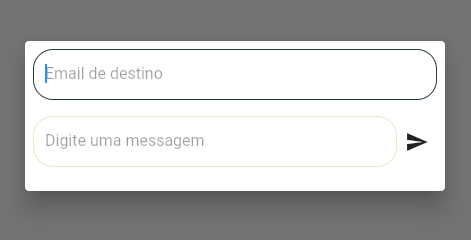
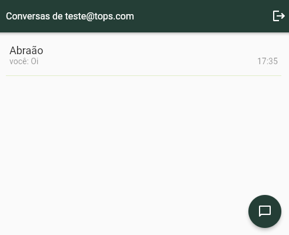
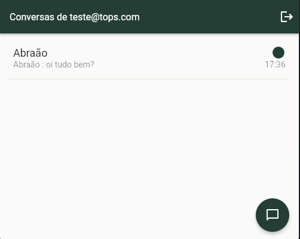

# Chat app

Um projeto de chat com flutter usando Firebase auth e Firestore.

## Primeiros passos para rodar na sua máquina.

1º Rodar o seguinte comando, após clonar o repo:

```sh
flutter pub get
```

**Obs:** O projeto roda com as versões mais atuais de flutter e dart. Talvez seja necessario atualizar o seu SDK.

## Página de Login


**Nessa pagina temos as seguintes funções:**

- Quando um usuário insere seus dados no formulário de login, ocorre o seguinte processo: uma requisição é enviada para o Firebase Authentication. Se a conta do usuário for encontrada e suas credenciais estiverem corretas, o estado de autenticação no Firebase Authentication é atualizado. Em seguida, o código abaixo, que monitora o estado de autenticação, entra em ação e realiza a seguinte operação:

```sh
Widget build(BuildContext context) {
  return Scaffold(
    body: StreamBuilder(
      stream: FirebaseAuth.instance.authStateChanges(),
      builder: (context, snapshot) {
        if (snapshot.hasData) {
          return const HomePage(); // Redireciona para a página inicial.
        } else {
          return const LoginPage(); // Mostra a página de login.
        }
      },
    ),
  );
}

```

- Se ocorrerem erros nas credenciais durante o processo de autenticação, uma mensagem será exibida para informar ao usuário o tipo de erro que ocorreu.

## Página de Registro



Na página de registro, assim como no login, há uma lógica para validar os dados e exibir a imagem de acordo. Após a conclusão bem-sucedida do processo de cadastro, o usuário é redirecionado para a página inicial, onde encontrará uma interface simples contendo apenas um botão para iniciar uma nova conversa. Que quando clicado abre um modal com dois campos.




Tente enviar uma messagem para os seguintes e-mails:

- abrxao@tops.com
- teste@gmail.com



